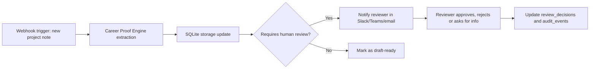

# n8n-Style Workflow Concept

This project does not require n8n to run locally. The automation folder shows how the Career Proof Engine can connect to n8n later through webhooks.

## Flow

## n8n Node Concept

1. **Webhook Trigger** receives project notes from a form, CRM, Slack, GitHub issue or copied portfolio summary.
2. **HTTP Request** posts JSON to the app or runs the CLI in a worker environment.
3. **SQLite / Storage Step** records the structured brief, risks, actions and questions.
4. **IF Node** checks `review_state`.
5. **Notification Node** alerts a human reviewer for `pending_review` or `needs_info`.
6. **Reviewer Callback** sends an approval/rejection payload and records the decision.

## Governance

The workflow must not finalise high-risk medical, defence, financial or regulatory outputs without human approval. Webhook payloads should include source references, confidence and review reasons so reviewers can audit the model output.
